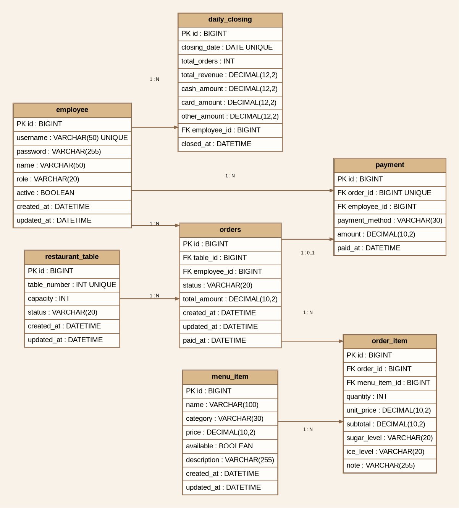
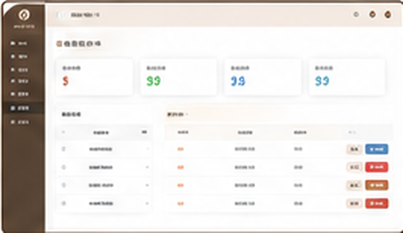
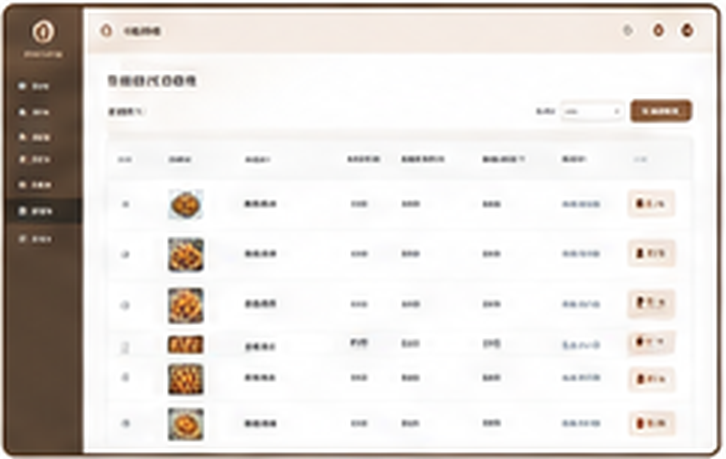
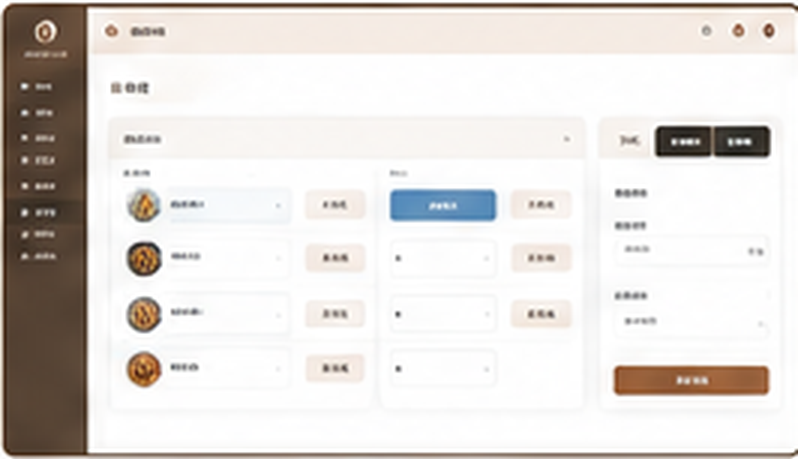
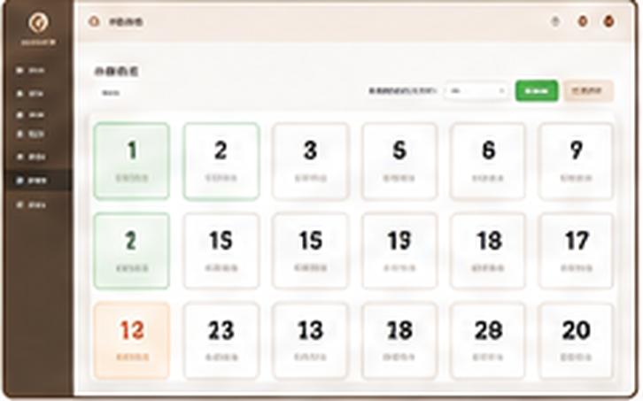
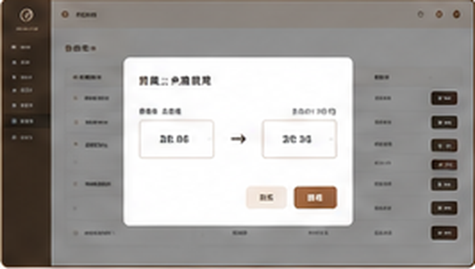
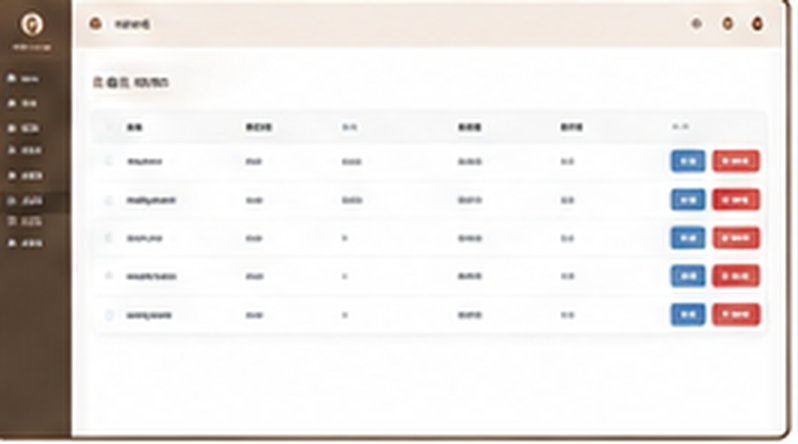
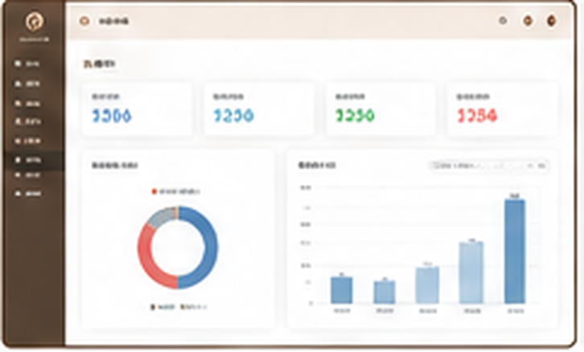
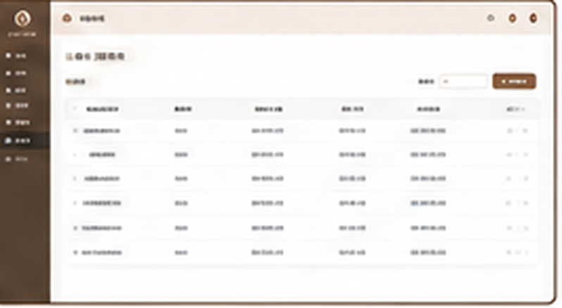

# Restaurant POS 餐廳管理系統

> 前後端分離的餐廳 POS 作品集專案，涵蓋登入驗證、菜單、點餐、桌位、換桌/併桌、結帳、員工、營收與日結管理。


---

## 專案簡介

Restaurant POS 是一套使用 **Spring Boot + React + MySQL** 開發的餐廳管理系統。後端採 REST API、JPA 與 Spring Security/JWT；前端使用 React、React Router、Axios 與 Bootstrap。

系統區分 **ADMIN** 與 **STAFF** 角色，除了前端路由與操作按鈕會依角色顯示，後端 API 也會再次進行權限驗證。

---

## 主要功能

- JWT 登入驗證與 ADMIN / STAFF 角色權限
- 菜單管理：餐點、飲料、甜點、販售/停售
- 點餐：新增品項、調整數量、刪除、備註
- 飲料客製：糖度、冰量
- 1～20 號桌桌位狀態管理
- 換桌：僅能換到空桌
- 併桌：可將來源桌訂單合併到目標桌
- 多種付款：現金、信用卡、LINE Pay
- 結帳後自動釋放桌位
- 員工管理：新增、修改、停用、密碼修改
- 最後一位啟用中的 ADMIN 保護
- 今日 / 指定日期 / 月營收
- 付款方式分項統計
- 日結：以上一次實際日結時間到本次日結時間計算
- 403 Forbidden / 404 Not Found 頁面
- 暖米白、木質風格響應式 UI

---

## 使用技術

| 類別 | 技術 |
|---|---|
| Backend | Java 17、Spring Boot 4.1.1、Spring MVC |
| Security | Spring Security、JWT、BCrypt |
| Persistence | Spring Data JPA、Hibernate |
| Database | MySQL |
| Build | Maven |
| Frontend | React 19、Vite 8、JavaScript |
| Routing | React Router |
| HTTP | Axios |
| UI | Bootstrap 5、CSS |

---

## 系統架構

```text
React Pages / Components
        │
        ▼
Frontend Services
        │
        ▼
Axios + Bearer JWT
        │
        ▼
Spring Security / JWT Filter
        │
        ▼
Controller
        │
        ▼
Service / ServiceImpl
        │
        ▼
Repository (JPA)
        │
        ▼
MySQL
```

---

## 專案結構

```text
restaurant-pos/
├─ backend/                  # Spring Boot 後端
│  ├─ src/main/java/com/restaurant/pos/
│  │  ├─ config/
│  │  ├─ controller/
│  │  ├─ dto/
│  │  ├─ entity/
│  │  ├─ enums/
│  │  ├─ exception/
│  │  ├─ repository/
│  │  ├─ security/
│  │  └─ service/
│  └─ pom.xml
├─ frontend/                 # React 前端
│  ├─ src/
│  │  ├─ api/
│  │  ├─ assets/
│  │  ├─ components/
│  │  ├─ pages/
│  │  ├─ services/
│  │  ├─ styles/
│  │  └─ utils/
│  └─ package.json
├─ database/
│  └─ restaurant_pos.sql
├─ docs/
│  ├─ er-diagram.png
│  └─ er-diagram.dot
├─ screenshots/
├─ .gitignore
└─ README.md
```

---

## ER Diagram



主要關聯：

- `employee` 1:N `orders`
- `restaurant_table` 1:N `orders`
- `orders` 1:N `order_item`
- `menu_item` 1:N `order_item`
- `orders` 1:0..1 `payment`
- `employee` 1:N `payment`
- `employee` 1:N `daily_closing`

---

## 權限設計

| 功能 | ADMIN | STAFF |
|---|:---:|:---:|
| Dashboard | ✅ | ✅ |
| 查看菜單 | ✅ | ✅ |
| 新增 / 修改 / 刪除菜單 | ✅ | ❌ |
| 點餐 | ✅ | ✅ |
| 桌位管理 | ✅ | ✅ |
| 換桌 / 併桌 | ✅ | ✅ |
| 結帳 | ✅ | ✅ |
| 員工管理 | ✅ | ❌ |
| 營收查詢 | ✅ | ❌ |
| 日結 | ✅ | ❌ |

後端 Spring Security 仍是最終權限防線，即使繞過前端 UI，無權限角色仍無法呼叫受保護 API。

---

## 訂單與桌位狀態

訂單狀態：

| Enum | 顯示 |
|---|---|
| `OPEN` | 用餐中 |
| `PAID` | 已付款 |
| `CANCELLED` | 已取消 |

桌位狀態：

| Enum | 顯示 |
|---|---|
| `AVAILABLE` | 空桌 |
| `OCCUPIED` | 使用中 |

付款方式：`CASH`、`CREDIT_CARD`、`LINE_PAY`。

---

## 核心流程

```text
登入
 ↓
Dashboard
 ↓
建立桌位訂單
 ↓
加入餐點 / 飲料客製 / 備註
 ↓
換桌或併桌（選用）
 ↓
結帳
 ↓
OPEN → PAID
 ↓
桌位 OCCUPIED → AVAILABLE
 ↓
Payment 紀錄
 ↓
營收統計 / 日結
```

---

## 換桌與併桌

### 換桌

- 來源桌必須有訂單
- 來源與目標桌不能相同
- 目標桌必須存在且為 `AVAILABLE`
- 換桌完成後訂單內容與金額維持不變

### 併桌

- 來源桌必須有訂單
- 目標桌可為空桌或已有訂單
- 若目標桌已有訂單，來源品項會移至目標訂單並重新計算金額
- 來源桌完成後釋放
- 多筆資料更新採 Transaction，失敗時可 Rollback

---

## 最後一位 ADMIN 保護

系統至少要保留一位 `active=true` 的 ADMIN。當只剩最後一位啟用中的管理員時，不允許：

- 停用帳號
- 將角色改為 STAFF
- 刪除 / 軟停用該帳號

避免整個系統失去管理權限。

---

## 日結設計

第一次日結區間：

```text
當日 00:00 → 本次實際日結時間
```

後續日結區間：

```text
上一次實際 closedAt → 本次實際 closedAt
```

查詢採 `>= start` 且 `< end`，避免重複計算或產生時間空隙；同一天不可重複日結。

---

## API 概要

### Authentication

```http
POST /api/auth/login
```

### Menu

```http
GET    /api/menu-items
GET    /api/menu-items/{id}
GET    /api/menu-items/category/{category}
GET    /api/menu-items/available
POST   /api/menu-items
PUT    /api/menu-items/{id}
DELETE /api/menu-items/{id}
```

### Orders

```http
GET    /api/orders
GET    /api/orders/{orderId}
GET    /api/orders/status/{status}
GET    /api/orders/date/{date}
POST   /api/orders
POST   /api/orders/{orderId}/items
PUT    /api/orders/{orderId}/items/{itemId}
DELETE /api/orders/{orderId}/items/{itemId}
PUT    /api/orders/{orderId}/cancel
```

### Tables

```http
GET  /api/tables
POST /api/tables/{tableNumber}/open
GET  /api/tables/{tableNumber}/order
PUT  /api/tables/{sourceTableNumber}/change/{targetTableNumber}
PUT  /api/tables/{sourceTableNumber}/merge/{targetTableNumber}
```

### Payment

```http
POST /api/payments/orders/{orderId}/checkout
```

### Employees（ADMIN）

```http
GET    /api/employees
GET    /api/employees/{id}
POST   /api/employees
PUT    /api/employees/{id}
PUT    /api/employees/{id}/password
DELETE /api/employees/{id}
```

### Revenue（ADMIN）

```http
GET /api/revenue/today
GET /api/revenue/date/{date}
GET /api/revenue/month/{yearMonth}
```

### Daily Closing（ADMIN）

```http
POST /api/daily-closing/{date}
GET  /api/daily-closing/{date}
```

---

## 啟動方式

### 1. 匯入資料庫

使用 `database/restaurant_pos.sql` 建立與初始化資料庫。

### 2. 啟動 Backend

```bash
cd backend
./mvnw spring-boot:run
```

Windows：

```bash
mvnw.cmd spring-boot:run
```

預設後端：`http://localhost:8080`

### 3. 啟動 Frontend

```bash
cd frontend
npm install
npm run dev
```

預設前端：`http://localhost:5173`

---

## 環境變數

Backend 可參考：

```text
backend/.env.example
```

Frontend 可參考：

```text
frontend/.env.example
```

前端預設 API：

```env
VITE_API_BASE_URL=http://localhost:8080/api
```

> 正式上傳 GitHub 時請勿提交真實資料庫密碼或 JWT Secret。

---

## 系統畫面

> 下列圖片為依本專案暖木質 UI 風格製作的作品集展示圖；實際執行畫面會依資料庫內容與瀏覽器尺寸略有不同。

### 登入


### Dashboard



### 菜單管理



### 點餐



### 桌位管理



### 換桌 / 併桌



### 結帳


### 員工管理



### 營收統計



### 日結管理



---

## 未來可擴充功能

- 會員與顧客資料
- 折扣、優惠券
- 電子發票
- 庫存與食材管理
- 廚房出單 / KDS
- QR Code 自助點餐
- 訂位系統
- 多店管理
- 圖表化營運 Dashboard
- Excel / PDF 報表
- Docker 化
- 雲端部署
- 自動化測試與 CI/CD

---

## 專案目的

本專案用於整合與實作：Java OOP、Spring Boot、REST API、JPA、MySQL、Spring Security、JWT、角色權限、React、Axios、React Router、Bootstrap，以及完整的前後端串接流程。

